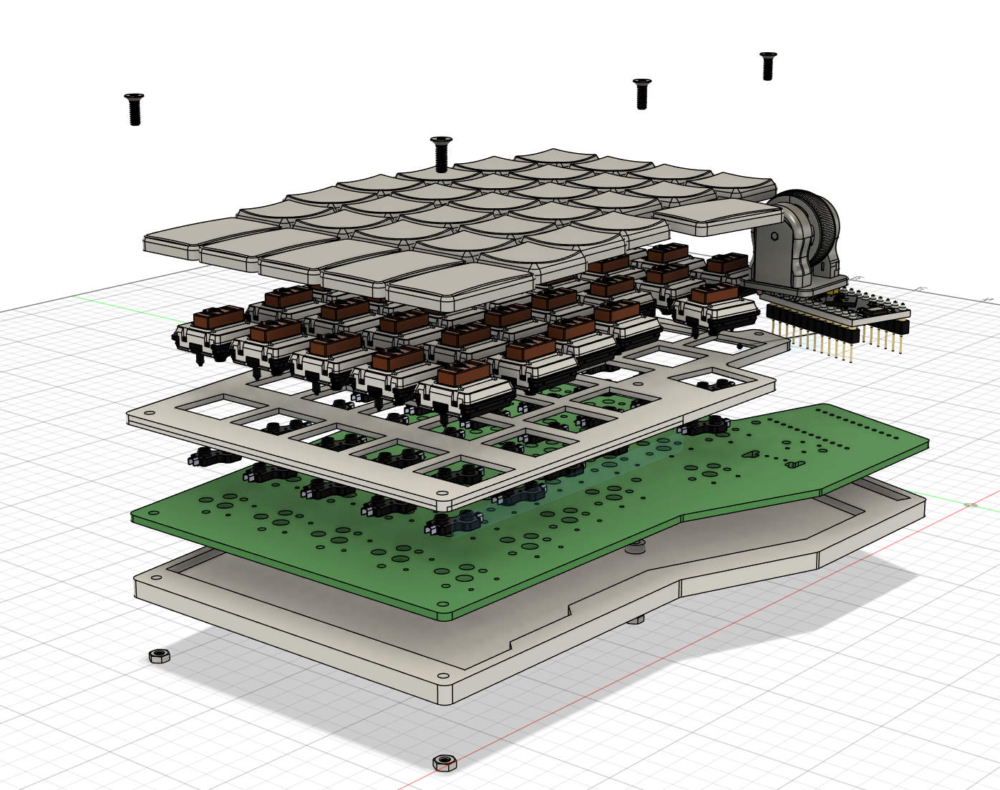
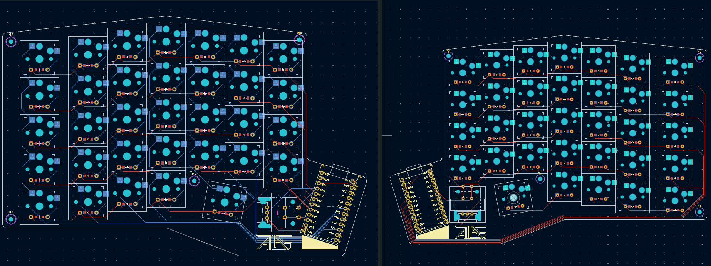

# ATLAS-keyboard
A custom low profile split keyboard designed for hack club highway! It has 33 keys on each side for a total of 66, and uses one these awesome open source [mouse wheel style encoders](https://github.com/Taro-Hayashi/THQWGD0010) by Taro Hayashi on each side for navigating text (they act as arrow keys, with the one on the left as an up and down, and the one on the right is left and right). The case also has a super minimal and low profile plateless design with no top frame that leaves the cool part of the PCB uncovered, and keeps the keys nice and low on my desk. It also features a system for creating adjustable tenting angles, which is nice because I'd like to find what works best for me comfort-wise! 
i named it atlas becasue umm uhh it'll help me with text navigation? (ok this is a stretch, i just like the word) 

# Overview
In exploring split keyboard layouts, I found that not many of them had all the keys that I wanted, and the ones that did had crazy layouts and sizes. I struck a balance between the two, minimizing the size of my keyboard by making it as low profile as possible and limiting it to only the keys that I wanted.

### NOTE: PCB's are based off of the [config.yaml](PCB files/config.yaml) Ergogen file, schematics are only used as reference.

## BOM 

|Item                                  |Count|Total Cost|Source     |Link                                                                 |Notes                                                                                       |
|--------------------------------------|-----|----------|-----------|---------------------------------------------------------------------|--------------------------------------------------------------------------------------------|
|Choc 1u Keycaps x10                   |6    |$21.00    |typeractive|https://typeractive.xyz/products/mbk-keycaps?variant=45419753111783  |                                                                                            |
|Choc 1.5u Keycaps x2                  |6    |$9.00     |typeractive|https://typeractive.xyz/products/mbk-keycaps?variant=48512019333351  |                                                                                            |
|Choc v1 Red Switches x10              |8    |$44       |typeractive|https://typeractive.xyz/products/choc-switches?variant=45741919240423|A little more expensive than some alternatives, but free shipping brings it below all others|
|Kailh Low Profile Hotswap Sockets x100|1    |$0.99     |aliexpress |https://www.aliexpress.us/item/3256803389452947.html                 |First time discount                                                                         |
|1N4148W SMD Diodes x100               |1    |$1.37     |aliexpress |https://www.aliexpress.com/item/3256806137153769.html                |                                                                                            |
|M2x6mm screws x50                     |1    |$1.74     |aliexpress |https://www.aliexpress.com/item/2255801062616407.html?mp=1           |                                                                                            |
|M2 Hex Nuts x50                       |1    |$1.51     |aliexpress |https://www.aliexpress.com/item/3256807407546447.html?mp=1           |                                                                                            |
|6x6x7 Tactile Button Switch x100      |1    |$2.07     |aliexpress |https://www.aliexpress.com/item/3256803858853331.html?mp=1           |                                                                                            |
|11mm Mouse Encoder x10                |1    |$1.56     |aliexpress |https://www.aliexpress.com/item/3256801290854651.html?mp=1           |                                                                                            |
|left PCB x5 + right PCB x5 + shipping |1    |$29.65    |JLCPCB     |https://www.jlcpcb.com/                                              |                                                                                            |
|Atmega32U4 Pro Micro Board Module x3  |1    |$19.88    |amazon     |https://a.co/d/17oYyaQ                                               |I want 3 just in case I blow one up or something, and this is a pretty good bundle          |
|Total:                                |     |$132.77   |           |                                                                     |                                                                                            |
