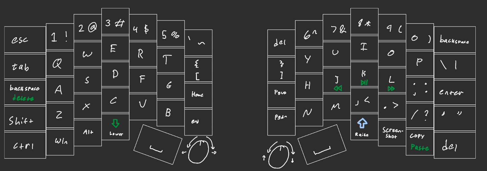

## June 29th
today i did some research into split keybaord layouts and tools for designing them. i learned how to use [Ergogen](https://github.com/ergogen/ergogen) to define a keyboard layout and designed this! i'm gonna use choc switches and low profile keycaps, and try to give the keyboard a clean, industrial look. 

This is the current layout ive settled on, but it'll 100% change once i get it and start typing on it :3

### time spent: 5 hrs
(i am a very slow worker and incredibly indecisive lol) 

## July 1st
i figued out how to use outlines in ergogen, and that allowed me to create this outline for the keyboad: 
 

i also learned how to turn the Ergogen yaml file into a KiCAD pcb and with a microcontroller, switches, and diodes, and automate the creation of the matrix net (?) so i dont have to do it all in a schematic! (for me as a first timer, this was 100% slower than it would have been to do manually in a schematic in KiCAD, but i was already too far in and now if i want to make another keyboard in the future, i know how to do it in a way that i can rapidly iterate :D )

tomorrow im going to add the rotary encoders, and route the whole pcb ! 
### time spent 5 hrs

## July 2nd
